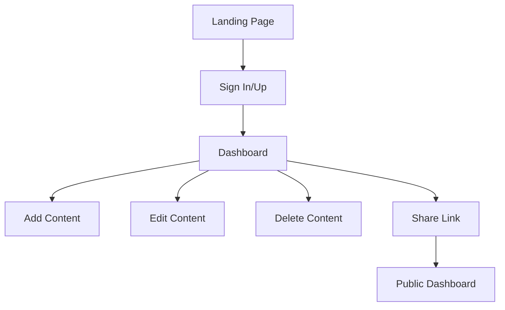

# 2ndMind Full Stack Application

This document provides a comprehensive overview of the 2ndMind application, including frontend specs and backend file details.

## Frontend

### Project Overview
2ndMind is a content management application built with Vite + React + TypeScript. It allows users to save, organize, and share content links from various platforms like Twitter, YouTube, Instagram, and others. The app features a modern UI with smooth animations, responsive design, and a clean, intuitive interface.

### Tech Stack
- **Frontend Framework**: Vite + React + TypeScript
- **Styling**: Tailwind CSS
- **Animations**: Framer Motion
- **Smooth Scrolling**: Lenis
- **HTTP Client**: Axios
- **State Management**: Zustand
- **Validation**: Zod

### API Endpoints
The frontend interacts with the backend via the following API endpoints:
- **POST /app/v1/sign-up**: User registration
- **POST /app/v1/sign-in**: User login
- **GET /app/v1/user/dashboard**: Get user's content
- **POST /app/v1/user/content/add**: Add new content
- **DELETE /app/v1/user/content/delete/:contentId**: Delete content
- **PATCH /app/v1/user/content/update/:contentId**: Update content
- **POST /app/v1/user/share**: Create or delete share link
- **GET /app/v1/user/public/:share_hash**: View public dashboard

All requests use JWT cookies for authentication.

### Pages/Routes
- **/**: Landing page
- **/sign-in**: Sign-in page
- **/sign-up**: Sign-up page
- **/dashboard**: User dashboard
- **/public/:share_hash**: Public dashboard
- **/** (404): Not found page

### Components
- **Header**: Navigation bar with logo and auth buttons
- **ContentCard**: Displays individual content items
- **AddEditModal**: Modal for adding/editing content
- **Footer**: Footer with links
- **LoadingSpinner**: Loading indicator
- **ErrorMessage**: Error display

### Interactions
- Smooth page transitions with Framer Motion
- Hover effects on cards and buttons
- Modal animations
- Form validation feedback
- Responsive navigation

### Animations
- Page enter/exit animations
- Staggered list animations
- Button hover states
- Loading animations
- Modal slide-in/out

### Accessibility
- Semantic HTML
- ARIA labels
- Keyboard navigation
- Focus management
- Color contrast compliance

### Implementation Notes
- Use Axios interceptors for auth
- Zustand for global state
- Zod for form validation
- Tailwind for responsive design
- Framer Motion for animations
- Lenis for smooth scrolling

### Mermaid Diagram


### Project Structure
```
src/
  components/
    Header.tsx
    ContentCard.tsx
    AddEditModal.tsx
    ...
  pages/
    Landing.tsx
    SignIn.tsx
    SignUp.tsx
    Dashboard.tsx
    PublicDashboard.tsx
    NotFound.tsx
  hooks/
    useAuth.ts
    useLenis.ts
  services/
    apiClient.ts
  stores/
    authStore.ts
  types/
    index.ts
  utils/
    ...
```

### Sample Code

#### API Client
```typescript
import axios from 'axios';

const apiClient = axios.create({
  baseURL: 'http://localhost:3000/app/v1',
  withCredentials: true,
});

export default apiClient;
```

#### Auth Store
```typescript
import { create } from 'zustand';

interface AuthState {
  isAuthenticated: boolean;
  user: any;
  login: (user: any) => void;
  logout: () => void;
}

export const useAuthStore = create<AuthState>((set) => ({
  isAuthenticated: false,
  user: null,
  login: (user) => set({ isAuthenticated: true, user }),
  logout: () => set({ isAuthenticated: false, user: null }),
}));
```

### Getting Started
1. Install dependencies: `npm install`
2. Start dev server: `npm run dev`
3. Build for production: `npm run build`
4. Preview production build: `npm run preview`

## Backend
This section provides a detailed overview of every file in the 2ndMind backend project, including purpose, key functionalities, dependencies, and full code snippets. The backend is built with Node.js, Express, TypeScript, and PostgreSQL using Drizzle ORM.

## Root Files

### package.json
- **Purpose**: Defines project metadata, scripts, and dependencies.
- **Key Details**:
  - Scripts: `dev` (nodemon with TypeScript compilation), `build` (TypeScript compilation), `start` (run built code), `generate` (Drizzle schema generation), `migrate` (Drizzle migrations).
  - Dependencies: Express, Drizzle ORM, bcrypt, jsonwebtoken, cors, helmet, morgan, express-rate-limit, zod, postgres.
  - DevDependencies: TypeScript, Drizzle Kit, type definitions for all packages.
- **Example**: Uses `nodemon` for development with auto-restart on file changes.

### tsconfig.json
- **Purpose**: TypeScript configuration for compilation.
- **Key Details**:
  - Targets ESNext, uses NodeNext module resolution.
  - Strict mode enabled with additional checks like `noUncheckedIndexedAccess`.
  - Outputs to `./dist`, sources from `./src`.
  - Includes JSX support (though not used in backend).
- **Note**: Configured for strict type checking to prevent runtime errors.

### .env
- **Purpose**: Environment variables (not committed to repo).
- **Key Variables**:
  - `DATABASE_URL`: PostgreSQL connection string.
  - `JWT_SECRET`: Secret for JWT signing.
  - `PORT`: Server port (default 3000).
  - `NODE_ENV`: Environment (development/production).
  - `Frontend_URL`: Allowed CORS origin.
- **Security**: Contains sensitive data; ensure not exposed.

### .gitignore
- **Purpose**: Specifies files to ignore in Git.
- **Contents**: `node_modules/`, `dist/`, `.env`, logs, OS files.
- **Note**: Prevents committing build artifacts and secrets.

## drizzle.config/ Directory

### drizzle.config.ts
- **Purpose**: Configuration for Drizzle Kit (ORM tool).
- **Key Details**:
  - Schema path: `./src/drizzle/schema.ts`.
  - Migrations output: `./src/drizzle/migrations`.
  - Database: PostgreSQL with URL from env.
  - Verbose and strict modes enabled.
- **Usage**: Run `npm run generate` to create migrations from schema changes.

## src/ Directory

### index.ts
- **Purpose**: Main entry point for the Express server.
- **Key Functionalities**:
  - Loads environment variables.
  - Sets up middleware: helmet (security), morgan (logging), global rate limiter, CORS (with credentials), JSON parsing, cookie parser.
  - Mounts routes under `/app/v1` with request ID middleware.
  - Applies error middleware.
  - Starts server on PORT.
- **CORS**: Allows specific origins with credentials for cookie-based auth.
- **Security**: Uses helmet for headers, rate limiting to prevent abuse.

### config/dbDrizzle.ts
- **Purpose**: Database connection setup using Drizzle ORM.
- **Key Details**:
  - Imports `drizzle` from `drizzle-orm/postgres-js`.
  - Creates connection with `DATABASE_URL`.
  - Exports `db` instance for queries.
- **Note**: Uses postgres-js driver for PostgreSQL.

### drizzle/schema.ts
- **Purpose**: Defines database schema using Drizzle ORM.
- **Tables**:
  - `UsersTable`: id (UUID), username, email (unique), password, timestamps.
  - `ContentTable`: id, title, description, link, type (enum: Twitter/Youtube/Instagram/Other), tags (array), userId (FK).
  - `tagsTable`: id, tags (unique, for vector search).
  - `LinkTable`: id, linkHash, userId (unique FK for share links).
- **Relations**: Defines one-to-many (user-content, user-link) and one-to-one (content-user).
- **Enums**: `contentType` for content types.

### drizzle/migrations/
- **Purpose**: SQL migration files generated by Drizzle Kit.
- **Files**:
  - `0000_certain_blob.sql`: Initial schema creation.
  - `0001_gigantic_obadiah_stane.sql`: Updates (e.g., added fields).
  - `meta/`: Journal and snapshots for migration tracking.
- **Usage**: Run `npm run migrate` to apply to database.

### controllers/
- **Purpose**: Handle business logic for routes.

#### signController.ts
- **Purpose**: Manages sign-up and sign-in.
- **Functions**:
  - `signUpController`: Hashes password, creates user, generates JWT, sets cookie, returns success.
  - `signInController`: Verifies credentials, generates JWT, sets cookie.
- **Dependencies**: Uses `createUser`, `findUser` from services, `createJWT`, `hashPassword`, `decodePassword`.

#### contentController.ts
- **Purpose**: Manages content CRUD and dashboard.
- **Functions**:
  - `dashboard`: Fetches user's content.
  - `addContent`: Adds new content.
  - `deleteContent`: Deletes by ID.
  - `updateContent`: Updates content.
  - `publicDashboard`: Fetches content by share hash.
- **Dependencies**: Uses Drizzle services for DB operations.

#### userController.ts
- **Purpose**: Handles user-specific actions like sharing.
- **Functions**:
  - `shareLink`: Creates or deletes share link based on boolean.
- **Dependencies**: Uses link table services.

### middlewares/
- **Purpose**: Express middlewares for various functionalities.

#### appError.ts
- **Purpose**: Custom error class.
- **Details**: Extends Error with statusCode, errorType, shouldShown. Captures stack trace.

#### asyncWrapper.ts
- **Purpose**: Wraps async routes to catch errors.
- **Details**: Passes errors to next middleware.

#### authMiddleware.ts
- **Purpose**: JWT authentication.
- **Details**: Checks cookie token, verifies JWT, sets req.userId.

#### contentMiddleware.ts
- **Purpose**: Validation and ID extraction for content routes.
- **Details**: Zod validation for content, extracts contentId from params.

#### errorMiddleware.ts
- **Purpose**: Global error handler.
- **Details**: Handles different error types (DB, JWT, etc.), logs, sends JSON responses.

#### requestIdMiddleware.ts
- **Purpose**: Adds unique request ID.
- **Details**: Uses crypto.randomUUID() for tracking.

#### signMiddleware.ts
- **Purpose**: Zod validation for sign routes.
- **Details**: Factory function for schema validation.

### routes/
- **Purpose**: Define API routes.

#### indexRoutes.ts
- **Purpose**: Root router.
- **Details**: Mounts sign and user routes, initial GET route.

#### signRoute.ts
- **Purpose**: Sign-up/sign-in routes.
- **Details**: POST /sign-up, /sign-in with validation and rate limiting.

#### userRoute.ts
- **Purpose**: User routes.
- **Details**: GET /dashboard, POST /share, mounts content routes under /content.

#### contentRoute.ts
- **Purpose**: Content CRUD routes.
- **Details**: POST /add, DELETE /delete/:contentId, PATCH /update/:contentId.

### services/drizzle/
- **Purpose**: Database service functions.

#### usersTable.ts
- **Purpose**: User-related DB operations.
- **Functions**: `createUser` (insert with hash), `findUser` (verify password).

#### contentTable.ts
- **Purpose**: Content DB operations.
- **Functions**: `getContentDBFunction`, `addContentDBFunction`, `deleteContentDBFunction`, `updateContentDBFunction`.

#### linkTable.ts
- **Purpose**: Share link operations.
- **Functions**: `createShareLinkFunc`, `deleteShareLinkFunc`, `dataByShareLinkFunc`.

### types/default.ts
- **Purpose**: Type definitions.
- **Details**: Likely custom types or interfaces (file may be minimal).

### utils/
- **Purpose**: Utility functions.

#### hashFunc.ts
- **Purpose**: Password hashing.
- **Functions**: `hashPassword` (bcrypt), `decodePassword` (compare).

#### jwt.ts
- **Purpose**: JWT handling.
- **Functions**: `createJWT` (sign), `checkJWT` (verify).

#### limiter.ts
- **Purpose**: Rate limiting.
- **Details**: Global limiter (100/5min), sign limiter (10/3min).

#### urls.ts
- **Purpose**: URL utilities (e.g., sign-in URL, may be unused).

### validator/zod/
- **Purpose**: Zod schemas for validation.

#### signZod.ts
- **Purpose**: Sign-up/sign-in validation.
- **Schemas**: `signInSchema` (email, password with regex), `signUpSchema` (extends with username).

#### contentZod.ts
- **Purpose**: Content validation.
- **Schemas**: `contentZodSchema` (title, link, type, description, tags), `contentValidator`.

### .gitignore
- **Purpose**: Git ignore file.
- **Contents**: `node_modules/`, `dist/`, `.env`, `.vscode/`, Drizzle build files.
- **Note**: Standard exclusions for Node.js projects.

### src/config/dbDrizzle.ts
- **Purpose**: Database connection configuration.
- **Key Details**:
  - Uses `postgres` library for connection.
  - Creates Drizzle instance with schema and logger enabled.
  - Throws error if `DATABASE_URL` not set.
- **Code Snippet**:
  ```typescript
  const postgresClient = postgres(databaseUrl);
  export const db = drizzle(postgresClient, { schema, logger: true });
  ```

### src/middlewares/asyncWrapper.ts
- **Purpose**: Wraps async route handlers to catch errors.
- **Details**: Returns a function that resolves the promise and catches errors, passing to `next`.
- **Code Snippet**:
  ```typescript
  export const asyncWrapper = (func: RequestHandler): RequestHandler => (req, res, next) => {
      return Promise.resolve(func(req, res, next)).catch(next);
  };
  ```

### src/types/default.ts
- **Purpose**: TypeScript module augmentation for Express.
- **Details**: Adds `requestId`, `userId`, `contentId` to Request interface.
- **Code Snippet**:
  ```typescript
  declare module "express-serve-static-core" {
      interface Request {
          requestId: string;
          userId: string;
          contentId: string;
      }
  }
  ```

### src/utils/urls.ts
- **Purpose**: URL constants.
- **Details**: Defines `signIn_Url` for localhost sign-in endpoint.
- **Code Snippet**:
  ```typescript
  export const signIn_Url: string = `http://localhost:4001/app/v1/sign/sign-in`;
  ```

### drizzle/migrations/0000_certain_blob.sql
- **Purpose**: Initial database migration.
- **Details**: Creates enum `contentType`, tables `contentTable`, `linkTable`, `usersTable`, `tagsTable`, with FKs and constraints.
- **Key SQL**: Defines UUID PKs, unique constraints on email and linkhash.

### drizzle/migrations/0001_gigantic_obadiah_stane.sql
- **Purpose**: Update migration.
- **Details**: Alters `linkTable.linkhash` to varchar(130) from varchar(60).

### drizzle/migrations/meta/_journal.json
- **Purpose**: Migration journal.
- **Details**: JSON tracking migration versions, timestamps, and tags.

### drizzle/migrations/meta/0000_snapshot.json & 0001_snapshot.json
- **Purpose**: Schema snapshots.
- **Details**: JSON representations of schema at migration points.